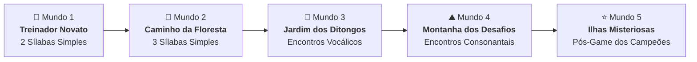

# ⚡ Soletrando com Pokémon

> **Um jogo educativo de alfabetização fônica, carinhosamente criado por um pai desenvolvedor para ajudar sua filha de 5 anos a aprender a ler e soletrar suas primeiras palavras com seus monstrinhos favoritos.**

<div align="center">


</div>

---

## 🎯 Sobre o Projeto & Motivação

Quando uma criança de 5 anos começa sua jornada de alfabetização, um dos maiores desafios é conectar o som falado (**fonema**) à forma escrita (**grafema**), sem que isso pareça uma tarefa exaustiva ou mecânica.

Minha filha é completamente apaixonada pelo universo de **Pokémon**. Aproveitando esse hiperfoco e entusiasmo natural, criei o **Soletrando com Pokémon**: uma aplicação interativa onde o ato de aprender a ler se transforma em uma jornada de Treinador Pokémon. Em vez de testes de ortografia frios ou punitivos, ela explora 5 mundos temáticos, junta os "pedacinhos sonoros" (sílabas) e captura 40 Pokémon para completar sua própria Pokédex.

---

## 🧠 Fundamentação Pedagógica (BNCC & Método Fônico)

O desenvolvimento deste jogo foi rigorosamente planejado com base nos princípios da alfabetização infantil e nas diretrizes da **BNCC (Base Nacional Comum Curricular)** para Educação Infantil e Ensino Fundamental:

### 1. Tipografia em Letra Bastão (Caixa Alta)
* Na fase inicial (5 a 6 anos), a criança possui controle motor e discriminação visual em desenvolvimento.
* Todas as sílabas e nomes do jogo são exibidos em **letra de fôrma maiúscula** (`PA - RAS`, `NA - TU`), evitando confusões clássicas de espelhamento entre letras cursivas ou minúsculas (como *b* e *d*, ou *p* e *q*).

### 2. Ordenação Direcional com Suporte Magnético
* Slots identificados ordinalmente (`1º`, `2º`, `3º`) reforçam a orientação natural da leitura ocidental: **da esquerda para a direita**.
* O jogo suporta toque direto no slot desejado ou preenchimento sequencial inteligente, adaptando-se à coordenação motora da criança em celulares, tablets ou computadores.

### 3. Consciência Silábica e Metalinguística
* As palavras são apresentadas divididas em **sílabas sonoras reais**, permitindo que a criança perceba que as palavras são formadas por blocos fonéticos que se juntam.
* A cada sílaba tocada, a voz pronuncia com clareza o som exato daquele bloco (`BÁ!`, `GÓN!`).

### 4. Pedagogia do Humor: Zero Punição
* **O jogo nunca pune o erro com sons estridentes ou mensagens negativas.**
* Se a criança inverter as posições (por exemplo, montar `CHU` + `PI`), o motor de voz lê exatamente o que ela escreveu de maneira bem-humorada:
  > *"CHÚ-PÍ! Ih, virou Chupi! Quem é esse Pokémon? Vamos trocar para formar Pichu?"*
* Isso ativa a **metacognição**: a criança ouve o resultado do próprio erro, ri da situação e espontaneamente reorganiza as peças para achar a palavra correta.

---

## 🗺️ A Jornada dos 5 Mundos (40 Pokémon Líderes)

Inspirado na clássica jornada dos **8 Líderes de Ginásio**, o jogo possui **5 Mundos**, cada um com **8 Pokémon** organizados em uma progressão de dificuldade fonética contínua:



| Mundo | Foco Pedagógico | Os 8 Pokémon do Mundo |
| :--- | :--- | :--- |
| **🌱 Mundo 1: Treinador Novato** | **2 sílabas canônicas e transparentes** (consoante-vogal simples, sem letras mudas ou complexidades) | **Natu**, **Ditto**, **Paras**, **Bagon**, **Zubat**, **Rotom**, **Aron**, **Gengar** |
| **🍃 Mundo 2: Caminho da Floresta** | **3 sílabas simples e cadenciadas** (ritmo ternário perfeito para cantarolar e memorizar) | **Togepi**, **Kakuna**, **Rattata**, **Celebi**, **Tangela**, **Corsola**, **Metapod**, **Ponyta** |
| **🌸 Mundo 3: Jardim dos Ditongos** | **Encontros vocálicos suaves** (sons de `AU`, `AI`, `UI`, `IA`, `IO`) | **Tauros**, **Aipom**, **Buizel**, **Cubone**, **Roselia**, **Altaria**, **Banette**, **Lucario** |
| **⛰️ Mundo 4: Montanha dos Desafios** | **Encontros consonantais com R e L** (`BR`, `CR`, `DR`, `PR`, `TR`, `CL`) | **Lapras**, **Dratini**, **Crobat**, **Cranidos**, **Abra**, **Dragonite**, **Cleffa**, **Moltres** |
| **⭐ Mundo 5: Ilhas Misteriosas** | **Campeões do Pós-Game** (dígrafos, grafias especiais em inglês e nomes icônicos) | **Pikachu**, **Pichu**, **Eevee**, **Squirtle**, **Psyduck**, **Snorlax**, **Bulbasaur**, **Charmander** |

---

## 🛠️ Tecnologias Utilizadas

* **[React 19](https://react.dev/):** Interface declarativa e reativa de alta performance.
* **[TypeScript](https://www.typescriptlang.org/):** Tipagem estática rigorosa para garantir estabilidade e previsibilidade.
* **[Tailwind CSS v4](https://tailwindcss.com/):** Estilização moderna através do motor Oxide de alta velocidade, com animações e micro-interações lúdicas.
* **[Vite](https://vite.dev/):** Bundler ultrarrápido para desenvolvimento e build otimizado.
* **[pnpm](https://pnpm.io/):** Gerenciador de dependências eficiente com cache compartilhado.
* **[Lucide React](https://lucide.dev/):** Ícones modernos e consistentes.
* **[Canvas Confetti](https://www.npmjs.com/package/canvas-confetti):** Celebração visual a cada captura concluída.

---

## 🌐 APIs & Recursos Integrados

### 1. [PokeAPI](https://pokeapi.co/)
* **Sprites em Alta Definição:** Artes oficiais dos Pokémon provenientes do repositório `PokeAPI/sprites/other/official-artwork`.
* **Gritos Originais (*Cries*):** Arquivos de áudio originais dos jogos Pokémon integrados para cada monstrinho via `PokeAPI/cries`.

### 2. Motor de Áudio Neural & Silabário Universal
* **Edge Neural TTS (`pt-BR-FranciscaNeural`):** Áudios com voz natural de estúdio gravados em português brasileiro de altíssima fidelidade.
* **262 Áudios Pré-renderizados:** Todo o silabário básico do português (de `BA` a `ZU`), encontros consonantais, ditongos e nomes dos Pokémon foram gerados e empacotados em `public/audio/`, funcionando **100% offline**, com latência zero e sem custos recorrentes de nuvem.
* **Fallback Inteligente:** Caso um novo Pokémon seja adicionado sem áudio do nome completo, o serviço de som concatena as sílabas neurais cadenciadas e usa a Web Speech API como contingência.

### 3. [GitHub REST API](https://docs.github.com/en/rest)
* O rodapé da aplicação consome dinamicamente os dados públicos do perfil do autor (`https://api.github.com/users/1felipeaac`), exibindo avatar, nome, biografia, contagem de repositórios públicos e localização, com tratamento resiliente e cache offline em caso de falha de conexão.

---

## 🚀 Como Executar o Projeto Localmente

### Pré-requisitos
* **Node.js** (versão 18 ou superior)
* **pnpm** instalado globalmente (`npm install -g pnpm`)

### Passo a Passo

1. **Clone o repositório:**
   ```bash
   git clone https://github.com/1felipeaac/aprenda-soletrar-com-pokemon.git
   cd aprenda-soletrar-com-pokemon
   ```

2. **Instale as dependências:**
   ```bash
   pnpm install
   ```

3. **Inicie o servidor de desenvolvimento:**
   ```bash
   pnpm dev
   ```
   Acesse a URL informada no terminal (geralmente `http://localhost:5173`) no seu navegador ou acesse pelo IP local no tablet ou smartphone da criança!

4. **Gerar ou sincronizar áudios neurais (opcional):**
   Caso adicione novos Pokémon em `src/data/pokemonData.ts` e queira baixar automaticamente as novas sílabas e nomes:
   ```bash
   pnpm sync-audio
   ```

5. **Gerar build de produção:**
   ```bash
   pnpm build
   ```

---

## ⚖️ Licença & Isenção de Responsabilidade (Disclaimer)

### Declaração de Uso Justo (Fair Use)
* **Pokémon** e os nomes de personagens, criaturas, imagens e sons são marcas registradas e direitos intelectuais de **© Nintendo**, **Creatures Inc.** e **GAME FREAK Inc.**
* Este projeto é um software **sem fins lucrativos**, desenvolvido de forma independente como uma **ferramenta educacional e familiar** voltada à alfabetização infantil. Não possui afiliação oficial, patrocínio ou endosso da Nintendo ou da Pokémon Company.

### Licença do Código-Fonte
O código-fonte deste repositório está sob licença **[MIT](LICENSE)**. Sinta-se livre para estudar, adaptar e usar para ensinar outras crianças a lerem com diversão!

---

## 👨‍💻 Autor & Agradecimentos

Desenvolvido com muito amor por **Felipe Coelho** para sua filha.

* **GitHub:** [@1felipeaac](https://github.com/1felipeaac)
* **Localização:** Timon - MA, Brasil

<div align="center">
  <sub>"Temos que pegar! Temos que ler!" ⚡📖</sub>
</div>
